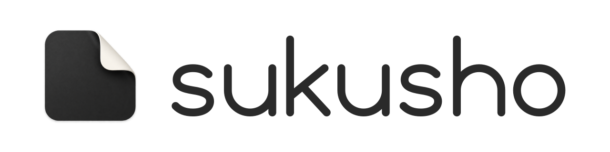

<h1 align="center">
  <picture>
    <source media="(prefers-color-scheme: dark)" srcset="docs/brand/readme-header-dark@2x.png">
    
  </picture>
</h1>

Sukusho is a native macOS app for screenshots, scrolling captures and screen recordings, with an editor, a Library for everything you capture, and share links served from your own Cloudflare Worker.

Sukusho started as a fork of [Screendrop](https://github.com/fayazara/Screendrop) by Fayaz Ahmed, and thanks go to that project for the foundation. It has since grown into a separate project: a heavily modified app with its own features, its own name and app identity, and its own Cloudflare Worker for share pages. The two apps install side by side and don't share updates.

> [!IMPORTANT]
> Sukusho is not affiliated with or supported by Screendrop or its author. Please report Sukusho problems here, not to the Screendrop project.

> [!NOTE]
> There are no releases yet. To use Sukusho, [build it from source](#building-from-source). It is under active development, so expect rough edges.

## Features

### Capture

Capture a display, a window, an area, a scrolling region, or just the text in an area. Sukusho runs from its menu bar item and global shortcuts:

| Default shortcut | Action |
| --- | --- |
| `Control + Option + 1` | Capture full screen |
| `Control + Option + 2` | Capture a window |
| `Control + Option + 3` | Capture an area |
| `Control + Option + 4` | Scrolling Capture |
| `Control + Option + 5` | Screen recording |
| `Control + Option + 6` | Capture Text to the clipboard |

Change any of them in **Settings → General**. If a shortcut can't be registered, Settings says why and keeps the previous one.

- **Screenshot options:** a 3, 5 or 10 second timer, optional window shadows, PNG or JPEG, an export folder, and a Save action that can skip the save panel.
- **After each capture**, choose any of: show the preview, copy, save, upload and copy the link, open the editor, or pin the screenshot above other windows.
- **Floating preview cards** let you copy, drag, save, compress, pin, Quick Look, edit, upload or delete a capture. Their actions can be rearranged in **Settings → Overlay**.
- **Capture Text** drags out an area, reads its text on-device with Vision, and puts the text on the clipboard. No image is saved.
- **Open With → Sukusho** in Finder imports a copy of an image and opens the copy in the editor. The original file is never changed.

### Scrolling Capture

Draw a box over a scrolling view, scroll through it at your own pace, and click **Done**. Sukusho lines up each new frame with the last one and adds only the rows that scrolled into view, giving one tall image up to 16,384 pixels high. If it loses its place, it shows the last rows it kept so you can scroll back to them, and **Done** always keeps what has been captured so far.

### Library

One window for screenshots, recordings and recording projects:

- Grid or list view with an adjustable card size, search, sorting, and a filter for screenshots or recordings.
- Tags with their own colours and icons.
- An inspector with dimensions, dates, duration, disk use and cloud sharing.
- **Space** for Quick Look, **Return** to rename, multi-select to copy, export, reveal or move to Trash.
- A **Cloud** section with your **Uploads**, plus **Comments** and **Likes** from your share pages, newest first.

Normal launches open the Library; launching at login stays quietly in the menu bar.

### Editor

Editing is non-destructive. The untouched image and an editable sidecar are kept side by side, so annotations can be reopened and changed later, and exports render at the image's full resolution.

- **Tools:** rectangle, circle, straight line, arrow, freehand, numbered circle, text, highlight, magnifier, pixelate and blur. Select, move, resize, undo and redo.
- **Snapping:** shapes snap to each other and to the image's edges and centre, with alignment guides.
- **Measuring:** hold an arrow key over the image to measure the width or height under the pointer; click to stamp that measurement onto the screenshot. **Tab** copies the colour under the pointer.
- **Smart Redaction** finds sensitive text and blurs or pixelates it, and the strength stays editable.
- **Crop** at full resolution with freeform and fixed ratios; annotations follow the crop.
- **Backgrounds:** colours, gradients, your own images or wallpaper packs, padding, corner radius, shadow, border, watermark, perspective and progressive blur, saved as presets you can share as `.screendroppreset` files.

### Screen recording and Studio

- Record a display, a window or an area, with a camera, a microphone and system audio as separate sources, a start timer, and a teleprompter that follows your narration on-device.
- A floating bar pauses, restarts, stops or discards the recording.
- Every recording is a non-destructive project. In Studio, cut and trim clips, change speed, add automatic or manual zooms, a reconstructed cursor, click highlights and keystroke captions, move and resize the camera, and pick a background and an aspect ratio for social formats.
- Transcribe narration on-device, edit captions, or cut the video by deleting words from its transcript.
- Export the finished composition, or share it straight to your Worker.

### Cloud sharing

Sharing is optional and self-hosted: uploads go to a Cloudflare Worker you deploy, which keeps files in R2 and metadata in D1. Sukusho only needs the Worker's URL and an upload token.

- **Share pages:** recordings get a video player with captions, a searchable transcript and scrub previews; screenshots get a clean viewer. Pages show view counts and rich link previews in chat apps.
- **Comments and likes** from viewers, which you can turn on or off for each share, with or without anonymous comments.
- **Share Options:** a title, a link expiry, an optional password, and whether comments and likes are allowed. **Settings → Cloud** sets the default link expiry and the share page's name, logo and favicon.
- Edited recordings upload the finished cut, followed by its poster, transcript and scrub previews.

### Automation

Capture and recording actions are available in Shortcuts, Siri and Spotlight.

## Privacy and permissions

- Captures, projects, edits and transcripts stay on your Mac. Transcription and text recognition run on-device.
- The upload token is kept in the Keychain. Nothing is uploaded unless you or an after-capture action asks for it.
- There is no Sukusho account or server, and no automatic app updates. The network is used only for your Worker, for checking whether your Worker has an update, for wallpaper downloads, and for the setup video in **Settings → Cloud** when you play it.

macOS asks for **Screen & System Audio Recording** for captures and recordings, and, when you first use them, **Camera**, **Microphone** and **Input Monitoring** (for keystroke captions). Sukusho's own windows are left out of captures unless you turn on **Settings → General → Include Sukusho windows in captures**.

## Building from source

Requirements:

- macOS 26.4 or newer.
- Xcode 27 beta (installed as `Xcode-beta.app`), with its Metal Toolchain for the Studio motion-blur shader:

  ```bash
  xcodebuild -downloadComponent MetalToolchain
  ```

- Your Apple Developer team ID, to sign the app.

Build Sukusho with your team ID in place of `YOUR_TEAM_ID`:

```bash
xcodebuild build -project Screendrop.xcodeproj -scheme Screendrop \
  -configuration Release -destination "platform=macOS" \
  DEVELOPMENT_TEAM=YOUR_TEAM_ID -allowProvisioningUpdates
```

The `Screendrop` scheme builds `Sukusho.app` (`com.tommyent.Sukusho`). The `Screendrop Dev` scheme with the `Debug Dev` configuration builds `Sukusho Dev.app` (`com.tommyent.Sukusho.dev`), which keeps its own data folder and keychain item, apart from Sukusho's. The Xcode target, schemes and Swift module keep the name Screendrop.

Run the test suite:

```bash
xcodebuild test -project Screendrop.xcodeproj -scheme "Screendrop Dev" \
  -configuration "Debug Dev" -destination "platform=macOS" \
  DEVELOPMENT_TEAM=YOUR_TEAM_ID -allowProvisioningUpdates
```

The tests use Swift Testing, need no app host, and never touch your captures or settings; see [ScreendropTests/README.md](ScreendropTests/README.md). Sparkle and DockProgress are the only package dependencies, and Xcode resolves them. [Editor performance](docs/editor-performance.md) and [export performance](docs/export-performance.md) describe the standalone checks and benchmarks.

If Screendrop was installed before, Sukusho brings over its captures, recordings, settings and Cloud token once, the first time it opens. Screendrop's own copy is left unchanged.

## Setting up the Worker

Sukusho's share pages, comments, likes and passwords come from this fork's Worker, [tommyent/screendrop-worker](https://github.com/tommyent/screendrop-worker), built on Cloudflare Workers with R2 and D1.

1. In Sukusho, open **Settings → Cloud** and copy the generated upload token.
2. Deploy the Worker from its repository:

   ```bash
   git clone https://github.com/tommyent/screendrop-worker.git
   cd screendrop-worker
   pnpm install
   npx wrangler secret put UPLOAD_TOKEN   # paste the token from step 1
   pnpm run deploy
   ```

   The deploy provisions the R2 bucket and D1 database; the database schema sets itself up on first use.
3. Paste the Worker's URL into **Settings → Cloud** and click **Verify Connection**.

The Worker's README covers updating an existing deployment and its API.

## Credits and licence

Sukusho is based on [Screendrop](https://github.com/fayazara/Screendrop) by Fayaz Ahmed, which its author dedicated to the public domain under [CC0 1.0 Universal](LICENSE-CC0). Code that came from Screendrop remains available under CC0. This fork's own changes are licensed under the [MIT License](LICENSE). See [NOTICE](NOTICE) for the details and for the licences of third-party packages.
